# A two-channel, one-processor, one-sink topology

This sequence diagram traces one Parsley task through a complete example. The topology is the
smallest one that exercises all three protocol layers: a single causal stage whose processor `p1`
consumes two source topics `c1` and `c2` and forwards to one sink topic `c3`.

```
c1-0 ─┐
      ├─> p1 (task 0_0) ─> c3-0
c2-0 ─┘
```

Sources must be co-partitioned, so this task owns partition 0 of both inputs and produces to
partition 0 of the sink. The three layers are the package-private modules described in
[the protocols overview](../docs/protocols/index.md): `ParsleyChannels` (L1) adapts Kafka
topic-partitions into reliable FIFO channels, `ParsleyCausalBroadcast` (L2) runs the
Birman-Schiper-Stephenson delivery gate over them, and `ParsleyGossip` (L3) keeps causal progress
observable through inputs that produce no business output.

Cross-participant arrows are calls from one collaborator to another. Self-directed arrows are
calls a participant makes on itself, including the work it does inside its own state stores.

## The scenario

The task starts with a contiguous frontier of `c1-0 @6` and `c2-0 @9`, restored from its state
store. Four things then happen in order, and each one demonstrates a different part of the stack.

1. **Init.** The stack is built bottom up, L1 first, and each layer takes the one below it as a
   collaborator.
2. **A held record.** `m1` arrives on `c2-0 @11` depending on `c1-0 @7`, an offset this node has not
   delivered. L1 bridges the transaction commit marker at `c2-0 @10`, L2's gate holds `m1` in the
   buffer, and L3 emits a heartbeat null message because L1's bridge advanced completeness with no
   business output to carry it.
3. **The cause, and the cascade.** `m2` arrives on `c1-0 @7`. Its dependency on `c4-0 @31` names a
   topic this node does not consume, so the gate ignores it. `m2` is delivered immediately, its
   delivery advances `c1-0` to `@7`, and the release cascade frees `m1` in the same pass. The
   delegate forwards a business record for `m2` and nothing for `m1`, so `m1` produces a null
   message instead.
4. **An inbound null message.** A null message arrives on `c1-0 @8` carrying claims about `c2-0`,
   which this node consumes, and about `c6-0`, which it does not. The consumed-channel claim is
   ahead of this node's knowledge, so the I6 relay rule fires. The other claim folds into the
   outbound stamp without obliging a relay.

## The diagram

```mermaid
sequenceDiagram
    autonumber
    participant c1 as c1-0 source channel
    participant c2 as c2-0 source channel
    participant p1 as ParsleyProcessor p1
    participant user as User Processor delegate
    participant ctx as ParsleyProcessorContext stamping proxy
    participant l3 as L3 ParsleyGossip
    participant l2 as L2 ParsleyCausalBroadcast
    participant l1 as L1 ParsleyChannels
    participant c3 as c3-0 sink channel

    Note over p1,l1: 1. init. The stack is built bottom up, each layer over the one below.

    p1->>p1: resolveTopicUuids(context)
    Note right of p1: c1, c2, c3 resolved to stable topic UUIDs.<br/>Names are never the channel identity (E1).
    p1->>l1: new ParsleyChannels(frontierStore, forwardedIndex)
    l1->>l1: load(blob)
    Note right of l1: One "frontier" value restores the contiguous frontier<br/>c1-0 @6, c2-0 @9, plus channel clocks, carried<br/>ancestry, own outputs and highest received.
    p1->>l1: rescope({c1, c2}, partition 0)
    l1->>l1: persist()
    p1->>l1: bindOwnOutputSource(registry, pendingSends, {c3}, deliveryTimeoutMs)
    p1->>l1: declareSinks({c3})
    p1->>l2: new ParsleyCausalBroadcast(channels, buffer, candidateIndex, forwardedIndex)
    p1->>l3: new ParsleyGossip(broadcast, {c3-0}, consumedScope)
    Note right of l3: L3 reaches L1 through broadcast.channels(),<br/>so all three layers share one channel state.
    p1->>user: init(stampingContext)

    Note over c2,c3: 2. m1 arrives on c2-0 @11 and is held. Its cause on c1-0 has not been delivered.

    c2->>p1: m1 at c2-0 @11, deps {c1-0: 7}
    p1->>p1: ensureTopicIdentityIntact()
    p1->>p1: classify(m1) = BUSINESS
    p1->>p1: ingest(m1)
    p1->>l2: completeness()
    p1->>l2: receive(m1)
    l2->>l1: alreadyDelivered(c2, 0, 11)
    l1-->>l2: false
    l2->>l2: recordReflectedClaims(m1.dependencies())
    l2->>l1: receive(c2, 0, 11)
    l1->>l1: seedIfFirstSeen(c2, 0, 11)
    l1->>l1: bridge(c2, 0, 11)
    Note right of l1: Offset 10 was a transaction commit marker that a<br/>read_committed consumer never returns. Bridging it<br/>keeps the contiguous walk from wedging: c2-0 goes 9 to 10.
    l1->>l1: persist()
    l1-->>l2: true, the frontier advanced
    l2->>l2: propagate(out, c2, 0)
    l2->>l1: normalize(deps, c2, 0, 11)
    l1-->>l2: {c1-0: 7}, no self-reference
    l2->>l2: isDeliverable(m1)
    Note right of l2: The gate checks this node's own delivered frontier only.<br/>c1-0 stands at @6 and the record requires @7, so m1 waits.
    l2->>l2: buffer.add(m1, seq) then candidateIndex.index(seq, deps, frontier)
    l2-->>p1: Outcome(delivered = [])
    p1->>l2: completeness()
    Note right of p1: Nothing was delivered, but the bridge moved completeness,<br/>so downstream must still learn about it. L3 emits a heartbeat.
    p1->>l3: advertise(m1.key, m1.timestamp)
    l3->>l2: broadcast(nullMessage, {c3-0})
    l2->>l1: awaitOwnOutputQuiescence({c3-0})
    Note right of l1: The crossing wait. Own-sink sends outside the destination<br/>set must be acknowledged before a stamp is taken, or the<br/>call throws rather than under-claim.
    l2->>l1: foldAcknowledgedOutputs()
    l1->>l1: acknowledge(c3, 0, offset) per acked send
    l2->>l1: stamp()
    l1->>l1: completeness().merge(ownOutputs).merge(highestDelivered)
    l1-->>l2: outbound clock
    l2-->>l3: record with the _parsley_causal_clock header
    l3-->>p1: null message, value null, marked _parsley_null_message
    p1->>p1: forwardToSinks(record), setting ParsleyMarkerPartition
    p1->>c3: context.forward(nullMessage)

    Note over c1,c3: 3. m2 arrives on c1-0 @7. It is delivered, and the cascade releases m1 behind it.

    c1->>p1: m2 at c1-0 @7, deps {c4-0: 31}
    p1->>p1: ensureTopicIdentityIntact() then classify(m2) then ingest(m2)
    p1->>l2: receive(m2)
    l2->>l1: alreadyDelivered(c1, 0, 7)
    l1-->>l2: false
    l2->>l1: receive(c1, 0, 7)
    l1-->>l2: false, no seed and no gap to bridge
    l2->>l1: normalize(deps, c1, 0, 7)
    l2->>l2: retaining(consumed) drops c4-0
    Note right of l2: The ignore branch. c4 is not consumed here, so the entry<br/>is a proxy for ancestry the same clock already states.<br/>Counted as a metric, never a failure.
    l2->>l2: isDeliverable(m2)
    Note right of l2: No consumed dependency remains, so m2 passes at once.
    l2->>l1: delivered(c1, 0, 7)
    l1->>l1: forwardedIndex.mark then absorbContiguous then persist
    Note right of l1: c1-0 advances from @6 to @7. Persist before pruning, so a<br/>torn crash strands a duplicate rather than the frontier.
    l2->>l1: channelUpdate(c1, 0, m2.dependencies())
    Note right of l1: The whole clock folds, own-sink coordinates included (I9).<br/>This feeds the outbound stamp only, never the gate.
    l2->>l2: propagate(out, c1, 0)
    l2->>l2: candidateIndex.findCandidates(c1, 0, 7) returns m1
    l2->>l2: isDeliverable(m1)
    Note right of l2: The cascade. c1-0 @7 is exactly what m1 was held on,<br/>so Lamport transitivity releases it in the same pass.
    l2->>l1: delivered(c2, 0, 11)
    l2->>l1: channelUpdate(c2, 0, m1.dependencies())
    l2->>l2: buffer.remove(seq)
    l2-->>p1: Outcome(delivered = [m2, m1])

    Note over p1,c3: deliver() pass 1 of 2. m2 reaches the delegate, which forwards a business record.

    p1->>p1: stampingContext.resetForwardCount()
    p1->>user: process(m2)
    user->>ctx: forward(outputRecord)
    ctx->>ctx: forwardCount++ then stamp(record)
    ctx->>l2: broadcast(record)
    l2->>l1: awaitOwnOutputQuiescence({})
    Note right of l1: A business forward gets no exemption. Its destination<br/>partition is unknowable at stamp time, so the wait is<br/>full quiescence over every own sink.
    l2->>l1: foldAcknowledgedOutputs()
    l2->>l1: stamp()
    l1-->>l2: {c1-0: 7, c2-0: 11, c3-0: acked, c4-0: 31}
    l2-->>ctx: record with the _parsley_causal_clock header
    ctx->>c3: delegate.forward(stamped)
    p1->>ctx: forwardCount()
    ctx-->>p1: 1, a business record carried this node's progress

    Note over p1,c3: deliver() pass 2 of 2. m1 reaches the delegate, which forwards nothing.

    p1->>p1: stampingContext.resetForwardCount()
    p1->>user: process(m1)
    p1->>ctx: forwardCount()
    ctx-->>p1: 0
    p1->>l3: advertise(m1.key, m1.timestamp)
    Note right of l3: A silent input would otherwise stall downstream<br/>completeness, which breaks the inductive correctness<br/>of a multi-layer topology. L3 stands in for it.
    l3->>l2: broadcast(nullMessage, {c3-0})
    l2-->>l3: stamped null message
    l3-->>p1: null message
    p1->>c3: context.forward(nullMessage)

    Note over c1,c3: 4. A null message arrives on c1-0 @8 from an upstream node.

    c1->>p1: null message at c1-0 @8, carried {c2-0: 14, c6-0: 3}
    p1->>p1: classify(record) = NULL_MESSAGE
    p1->>p1: handleNullMessage(record)
    p1->>l3: receive(c1, 0, 8, carried)
    l3->>l1: receive(c1, 0, 8)
    l1-->>l3: false, nothing to seed or bridge
    l3->>l2: recordReflectedClaims(carried)
    l3->>l1: foldAcknowledgedOutputs()
    l3->>l1: stamp()
    l3->>l3: stamp.dominates(carried.retaining(consumedScope))
    Note right of l3: The I6 relay rule, taken before the carried clock folds.<br/>Only the c2-0 claim is in consumed scope, and at @14 it is<br/>ahead of this node's @11, so a relay is obliged.
    l3->>l1: channelUpdate(c1, 0, carried)
    Note right of l1: The c6-0 claim folds here too. Custody news reaches the<br/>stamp but never obliges a message, which is what lets a<br/>topology with cycles quiesce.
    l3->>l1: delivered(c1, 0, 8)
    l3->>l2: propagate(out, c1, 0)
    l3-->>p1: Reception(delivered = [], advancedConsumedChannel = true)
    p1->>p1: deliver(reception.delivered())
    p1->>l3: advertise(record.key, record.timestamp)
    Note right of p1: The relay reuses the incoming key and timestamp, so it<br/>stays co-partitioned downstream and carries the original<br/>trigger's event time rather than the wall clock.
    l3->>l2: broadcast(nullMessage, {c3-0})
    l2-->>l3: stamped null message
    l3-->>p1: null message
    p1->>c3: context.forward(nullMessage)
```



## What each layer is responsible for

`ParsleyChannels` never decides delivery. It records what arrived, repairs the offset density Kafka
does not provide, owns the contiguous frontier, tracks acknowledged own outputs, and persists all of
it as one value. Every call into it in the diagram is either a question about channel state or a
report that L2 has made a decision.

`ParsleyCausalBroadcast` owns the gate, the hold-back buffer, the cascade, and the single stamping
site. It reads the frontier from L1 but never the advertised channel clocks, which is what keeps a
peer's claim from releasing a record before local delivery of its cause. Every outbound record in
the diagram, business or protocol, takes its clock from the one `broadcast` call, so the two kinds
of stamp cannot diverge.

`ParsleyGossip` adds nothing to the gate. It delivers a null message's own offset through L2's
cascade, folds the carried clock into L1 for the outbound stamp only, and decides whether to relay.
Steps 2 and 3 show it standing in for a business output that did not happen, and step 4 shows it
carrying a peer's progress onward.

## Rendering

The fence above renders directly on GitHub and in any mermaid-aware viewer. To produce an image,
copy the fence body into a `.mmd` file and run it through the mermaid CLI:

```
npx -y @mermaid-js/mermaid-cli -i diagram.mmd -o diagram.svg
```
